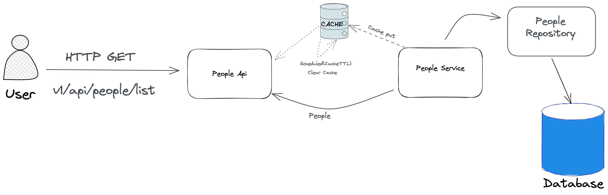
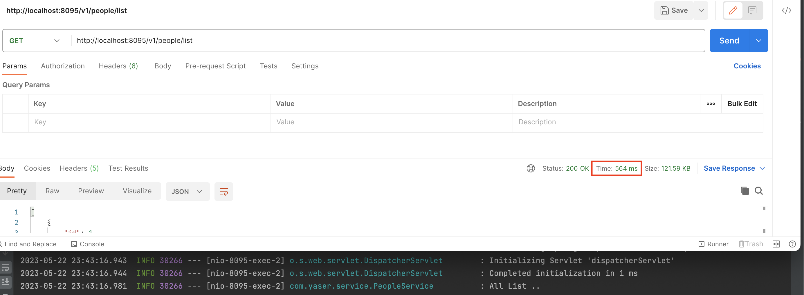
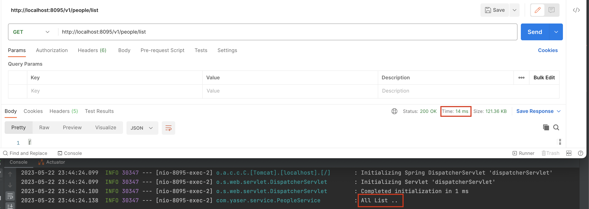

# How can use Spring Cached ?

---
### Spring Cached



### How does the application works?

The application follows the following steps:
* Initially, 1000 data entries are generated using the Faker library. These entries represent simulated people data.
* The application exposes two endpoints: `/v1/people/list` and `/v1/people/list/{age}`. 
These endpoints serve the purpose of retrieving the list of people.
* When a request is made to retrieve the list of people, the application checks if the data is already cached.
* If the requested data is found in the cache, it is retrieved directly from the cache, reducing the turnaround time and avoiding unnecessary database queries.
* In case the requested data is not present in the cache, the application retrieves it from the data source (in this case, the generated data).
* After retrieving the data, the application stores it in the cache for future requests, improving the response time for subsequent calls.
* The cache is cleared whenever new data is recorded, ensuring that the cache stays up-to-date with the latest changes.
* Additionally, the cache is cleared automatically every 10 seconds using a scheduled task. This helps to refresh the cache periodically, allowing the application to reflect any changes made in the data source.
* By utilizing Spring Cache, the application optimizes response times by caching frequently accessed data, reducing the reliance on expensive database queries and improving overall performance.
  
Feel free to customize and enhance this explanation based on your specific application and requirements.

## Caching Operations
In this project, Spring Cache is used for caching operations. Below are some important annotations and their functionalities:

* `@EnableCaching` : This annotation is used in the configuration class to enable caching functionality.
* `@Cacheable` : This annotation is used to cache a method. If the data is found in the cache, it is retrieved directly, and the method is not executed.
* `@CacheEvict` : This annotation is used to evict a method from the cache. When a specific data source is updated or deleted, the corresponding data or all data is cleared from the cache.
* `@CachePut` : This annotation is used to add or update a method in the cache. It always executes the method and saves the result in the cache.
* `@CacheConfig` : This annotation provides caching configuration at the class level. It can be used to define the cache name and other caching settings.

## Technologies

---
- Java 11
- Spring Boot 2.78
- Spring Data JPA
- Restful API
- Maven
- Faker
- Spring Cached
- Github Actions


## Prerequisites
---
- Maven
- Mysql (Don't forget to set the database information)
---

## Maven Run
To build and run the application with `Maven`, please follow the directions below;

```sh
$ cd SpringCached
$ mvn clean install
$ mvn spring-boot:run
```

## Duration Comparison
### Time before cache is loaded


---
### After cache is loaded


---
### NOT
* Spring Cache provides a convenient solution for reducing the unnecessary overhead of querying the database repeatedly during active usage. By utilizing caching, we can alleviate the burden of frequent database queries and make our lives easier.
* With caching, the application stores frequently accessed data in memory, such as in-memory cache or distributed cache. This allows subsequent requests for the same data to be served directly from the cache, eliminating the need to hit the database every time.
* By avoiding database queries, we significantly reduce the processing time and resource utilization required to fetch the data. This leads to improved application performance, lower response times, and reduced load on the database server.
* Caching not only enhances the overall system efficiency but also enhances the user experience by providing faster response times. It allows us to strike a balance between data consistency and performance, as the cached data can be periodically refreshed or invalidated based on the specific requirements of our application.

In summary, the cache system offered by Spring Cache simplifies our lives by minimizing unnecessary database queries, optimizing performance, and reducing the overall workload on the system.


## Providing

---
- Postman <a href="/assets/SpringCached.postman_collection.json" download>collections</a> can be accessed under the Asset folder.
---

